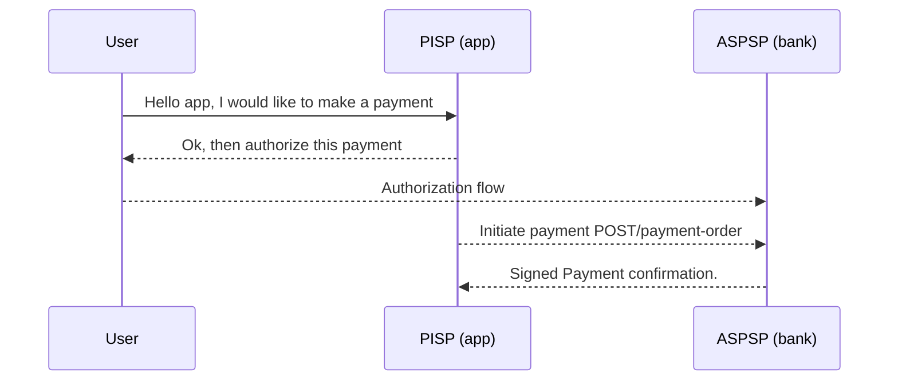

# Openbanking.nr&#8203;

Payments in the openbanking standard are signed by the bank using JWS/JWT formats. A proof of computation over the private payment data can prove to a smart contract verifier that an offchain bank-bank payment without revealing unnecessary private data. 


## Table of Contents
- [Overview](#Overview)
- [Background: The Open Banking Standard](#Background-The-open-Banking-Standard)
  - [Third-Party Providers (TPPs)](#TPPs)
  - [The Payment Flow](#The-Payment-Flow)
  - [Payment Initiation API (V.3.1.2)](#Payment-Initiation-API-V312)
  - [References](#References)
- [Cryptography in Open Banking](#Cryptography-in-Open-Banking)
  - [Trust Providers](#Trust-Providers)
  - [JWK Structure](#JWK-Structure)
  - [List of Valid Signing Algorithms](#List-Of-Valid-Signing-Algorithms)
  - [TLS1.2-mutual authentication](#TLS12-mutual-authentication)
  - [TLSN vs Signatures](#TLSN-vs-Signatures)
- [openbanking.nr scope](#openbankingnr-Scope)
  - [Dependencies](#dependencies)
  - [Library](#library)
  - [Payment types implementations target](#payment-types-implementations-target)
    - [Domestic Payments v3.1.2](#domestic-payments-v312)
    - [International Payments v3.1.2](#international-payments-v312)
- [Potential problems](#potential-problems)
- [Future directions/questions](#future-directionsquestions)
- [License](#license)


## Background: The Open Banking standard 

Open Banking is a unified interface standard implemented across financial institutions in the UK and Europe today and US are adopting in few years. This standard enables secure and standardized communication between banks and authorized third-party providers (TPPs). 


### TPPs 

TPPs are apps and services that invite users to use them (eg. insurance, fintech product..etc). 

TPPs have different permissions and are categorized into:
- **AISPs (Account Information Service Providers)**: Entities with permissions to read account and transaction data.
- **PISPs (Payment Initiation Service Providers)**: Entities authorized to initiate payments on behalf of users.

An entity might be both a AISP and a PISP. 


### The Payment flow 

Users initiate payments with PISPs who then get back signed payment confirmations form the bank once its processed. Payment initiations and responses occur between the PISP and the bank using signatures in jwt's. 

Simplified sequence diagram for PISP users: 


full version can be found on: https://openbanking.atlassian.net/wiki/spaces/DZ/pages/1077805743/Payment+Initiation+API+Specification+-+v3.1.2


### Payment Initiation API (V.3.1.2) 

The user initiates payment through the PISP 
The payment confirmation occurs between a PISP and bank. 
The payment is signed as a JWS using PS256.  

Response Format Example: 
```
HTTP/1.1 201 Created
x-jws-signature: V2hhdCB3ZSBnb3QgaGVyZQ0K..aXMgZmFpbHVyZSB0byBjb21tdW5pY2F0ZQ0K
x-fapi-interaction-id: 93bac548-d2de-4546-b106-880a5018460d
Content-Type: application/json
 
{
  "Data": {
    "DomesticPaymentId": "7290-003",
    "ConsentId": "7290",
    "Status": "AcceptedSettlementInProcess",
    "CreationDateTime": "2017-06-05T15:15:22+00:00",
    "StatusUpdateDateTime": "2017-06-05T15:15:22+00:00",
    "Initiation": {
      "InstructionIdentification": "ANSM023",
      "EndToEndIdentification": "FRESCO.21302.GFX.37",
      "InstructedAmount": {
        "Amount": "20.00",
        "Currency": "GBP"
      },
      "DebtorAccount": {
        "SchemeName": "UK.OBIE.SortCodeAccountNumber",
        "Identification": "11280001234567",
        "Name": "Andrea Smith"
      },
      "CreditorAccount": {
        "SchemeName": "UK.OBIE.SortCodeAccountNumber",
        "Identification": "08080021325698",
        "Name": "Bob Clements"
      },
      "RemittanceInformation": {
        "Reference": "FRESCO-037",
        "Unstructured": "Internal ops code 5120103"
      }
    }
  },
  "Links": {
    "Self": "https://api.alphabank.com/open-banking/v3.1/pisp/domestic-payments/7290-003"
  },
  "Meta": {}
}
```

### References 


- Specifies the overall standard between entities: 
https://openbanking.atlassian.net/wiki/spaces/DZ/pages/1150124033/Directory+2.0+Technical+Overview+v1.7
- Payment initiation spec: 
https://openbanking.atlassian.net/wiki/spaces/DZ/pages/1077805743/Payment+Initiation+API+Specification+-+v3.1.2
- For Domestic payments specification: 
https://openbanking.atlassian.net/wiki/spaces/DZ/pages/1077805743/Payment+Initiation+API+Specification+-+v3.1.2
- Revolut example of response format: 
https://developer.revolut.com/docs/guides/build-banking-apps/tutorials/initiate-your-first-payment#7-check-the-status-of-the-payment
- OpenID (The underlying standard the openabanking is based on) :  
https://openid.net/specs/openid-financial-api-part-2-1_0.html


## Cryptography in Open Banking 

Open Banking uses a certificate authority to manage public keys and certificates that ensure secure communications and signatures. The Directory provides a publicly accessible store of all Open Banking (OB) issued digital certificates, implemented as JSON Web Key Stores (JWKS). This store manages public keys for both TLS and signing keys.


### Trust Providers

- **eIDAS Certificate Authorities (EU)**: Trust providers managing qualified certificates. (https://eidas.ec.europa.eu/efda/trust-services/browse/eidas/tls)

- **OB Certificate Authority (UK)**: Manages the issuance of production certificates.
  - Documentation: [OB Root and Issuing Certificates](https://openbanking.atlassian.net/wiki/spaces/DZ/pages/80544075/OB+Root+and+Issuing+Certificates+for+Production)
  - Public JWKS retrieval of OB command:
    ```bash
    curl -k -X GET "https://keystore.openbanking.org.uk/keystore/openbanking.jwks"
    ```

### JWK Structure (for certificate lookup)
Refer to the [Open Banking Directory 2.0 Technical Overview](https://openbanking.atlassian.net/wiki/spaces/DZ/pages/1150124033/Directory+2.0+Technical+Overview+v1.7) for more details.

| Claim     | Description |
|-----------|-------------|
| `kty`     | Key type. Can be EC (Elliptic Curve) or RSA. |
| `use`     | Usage of the certificate, e.g., `sig` (signature), `tls`, or `enc` (encryption). |
| `key_ops` | The key operations supported by this public key. |
| `kid`     | The SHA-1 hash of the JWK Fingerprint. |
| `x5u`     | A URL to retrieve the PEM file for the X.509 certificate. The PEM file includes the entire certificate chain. |
| `x5c`     | An array with a single element containing the base64 representation of the X.509 certificate's PEM format. |
| `x5t`     | The SHA-1 hash of the DER-encoded certificate. |
| `x5t#s256`| The SHA-256 hash of the DER-encoded certificate. |

### Signatures

##### List of Valid Signing Algorithms

check details on message signing within openbanking here:
https://openbanking.atlassian.net/wiki/spaces/DZ/pages/1077805207/Read+Write+Data+API+Specification+-+v3.1.2#Read/WriteDataAPISpecification-v3.1.2-MessageSigning.1

It seems the PS256 is required in v3.1.2 Although in earlier versions it seems to have been more open based on v2.0 docs. https://openbanking.atlassian.net/wiki/spaces/DZ/pages/127009221/Read+Write+Data+API+Specification+v2.0.0#Read/WriteDataAPISpecification-v2.0.0-MessageSigning.1


JSON Web Signatures (JWS) are used within the OAuth 2.0 framework, as described in [RFC 7515](https://datatracker.ietf.org/doc/html/rfc7515) Refer to [RFC 7518 Section 3.1](https://datatracker.ietf.org/doc/html/rfc7518#section-3.1) for supported algorithms in the wider JWS standard. 

| Type    | Algorithms        | Description                |
|---------|-------------------|----------------------------|
| HMAC    | HS256, HS384, HS512 | Symmetric key signing.     |
| RSA     | RS256, RS384, RS512 | Asymmetric RSA signing.    |
| ECDSA   | ES256, ES384, ES512 | Elliptic curve signing.    |
| PSS     | PS256, PS384, PS512 | Enhanced RSA signing.      |              |


### TLS1.2-mutual authentication

ma: means both client and server verify each other's identities by exchanging and verifying digital certificates in contrast to only the server's cetificate verified by the client. 

Check the sequence diagrams that show the tls interactions betweetn tpp and aspsp to see where tls is used exactly. domestic payment diagram. 

### TLSN vs Signatures

Since payments initiation is signed, then that is the ideal trust assumption because it is a first party attestation. However some information data is not signed but information is sent with tls between the aisp and the bank. 

Account information flows like transaction history is not signed by the bank by default. The use of signatures might be optional.  so implementors of the standards can optionally add signatures to all response and request payloads. Does that mean we can have signed informatiom data too? That would be more ideal than tls. 


## openbanking.nr Scope 

### Dependencies: 
- [x] RSA : 
- [x] JWT processing: https://github.com/Envoy-VC/noir_jwt , https://github.com/zkemail/noir-jwt 

### Library: 
- [ ] Domestic Payment circuit (single immediate payment) 
- [ ] Certificate chain validation logic (PKI)
- [ ] PISP e2e example with JS


### Payment types implementations target 

#### Domestic Payments v3.1.2 
- [X] Single immediate payments  
- [ ] Scheduled payments
- [ ] Standing orders
- [ ] Bulk payments

#### International Payments v3.1.2
-  [ ] Single immediate payments
 - [ ] FX rate validation
 - [ ] Cross-border rules compliance
 - [ ] Charge bearer verification

The scope of the library can be extended beyond payments and into account information with a tls proof flow to generate proofs over private data. For example a public credit scoring algorithm on historic transaction without revealing tx history.


## Potential problems 

- In this set up where we are counting on the TPP to provide the signed data, there is a liveness assumption on the TPP. The PISP can withhold the transaction details (the payload) needed to prove onchain a smart contract. However the PISP cannot steal funds. 
- Is the certificate authority fully public?without any constraints on who accesses it? Are there legal issues with putting those bank public keys onchain?


## Future directions

- TLS proofs: Account and transaction history flows between the AISP and the bank are not signed. Otherwise obtaining history would be a more convenient way to prove a payment rather than doing it one by one with the payment signatures approach. However, it could be interesting to use a tls notary to perhaps prove those communications.  


